# CatBoost+Optuna를 확용한 품질 상태 분석
[코드 파일 링크](https://github.com/Parksemo/Ark_Project/blob/master/%EB%8D%B0%EC%9D%B4%ED%84%B0%EB%B6%84%EC%84%9D/catboost%20%2B%20optuna/CatBoost%2BOptuna%EB%A5%BC%20%ED%99%95%EC%9A%A9%ED%95%9C%20%ED%92%88%EC%A7%88%20%EC%83%81%ED%83%9C%20%EB%B6%84%EC%84%9D.ipynb)

## 라이브러리 설정
```python
# 기본 라이브러리
import numpy as np
import pandas as pd
import os
import warnings
import random

# 전처리 라이브러리
from sklearn.preprocessing import LabelEncoder

#시각화 라이브러리
import seaborn as sns
import matplotlib.pyplot as plt
plt.rcParams['font.family'] ='Malgun Gothic' #한글 깨짐 문제 방지
plt.rcParams['axes.unicode_minus'] =False

# 옵션 라이브러리
warnings.filterwarnings('ignore') # warinings 문구 생략 
pd.set_option('display.max_columns',20) # 열 20개 보여주기
pd.set_option('display.max_rows',20) #행 20개 보여주기

# 모델 라이브러리
from sklearn.model_selection import train_test_split # 데이터 분리
from sklearn.metrics import mean_squared_error #MSE
from sklearn.model_selection import StratifiedKFold # StratifiedKFold  과적합방지
from catboost import CatBoostClassifier, CatBoostRegressor # CatBoost

# Optuna : 하이퍼파라미터 최적화 프레임워크
import optuna
from optuna import Trial
from optuna.samplers import TPESampler
```
<br>

## 데이터 불러오기
```python
train = pd.read_csv('train.csv')
test = pd.read_csv('test.csv')
sub = pd.read_csv('sample_submission.csv')
```
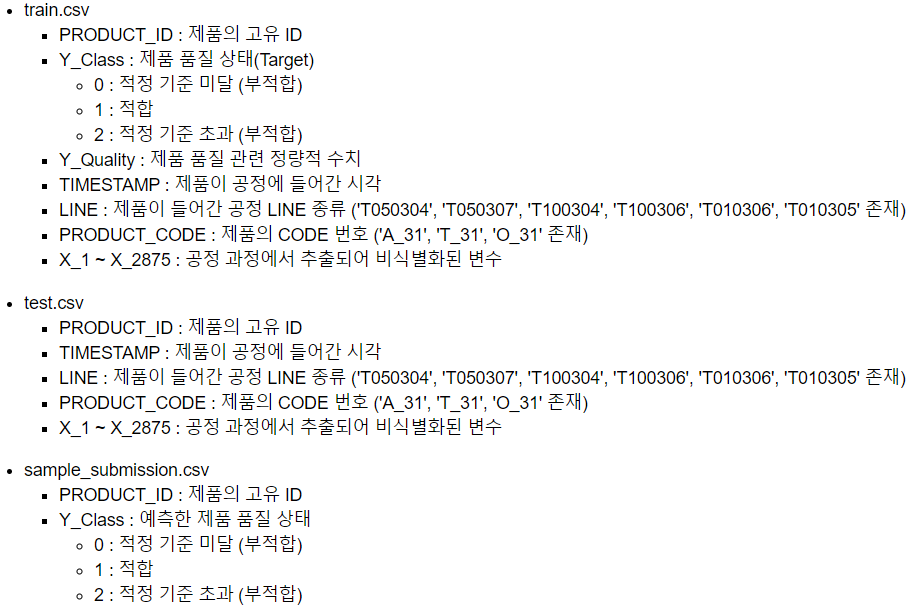
<br>

## EDA(탐색적 데이터 분석)
### Y_Class (제품 품질 상태(Target)) 분포
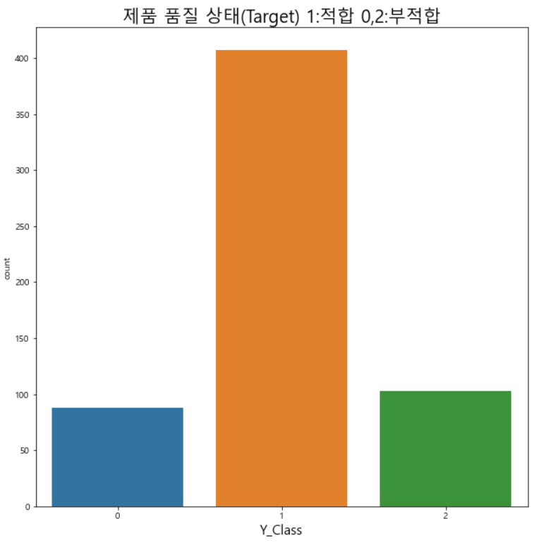
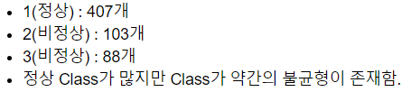
<br>

### Y_Quality(제품 품질 관련 정량적 수치) 분포
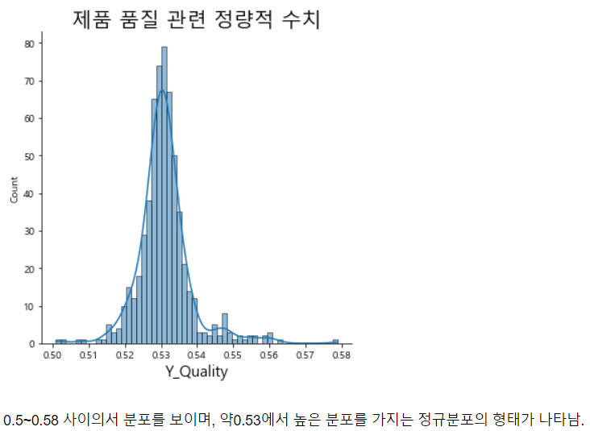
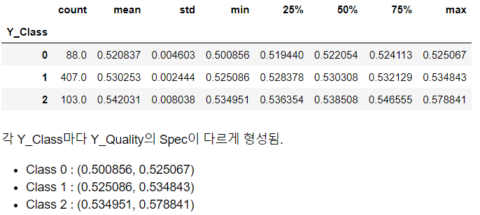
<br>

### TIMESTAMP (제품이 공정에 들어간 시각) 분포
#### 일자 별 분포
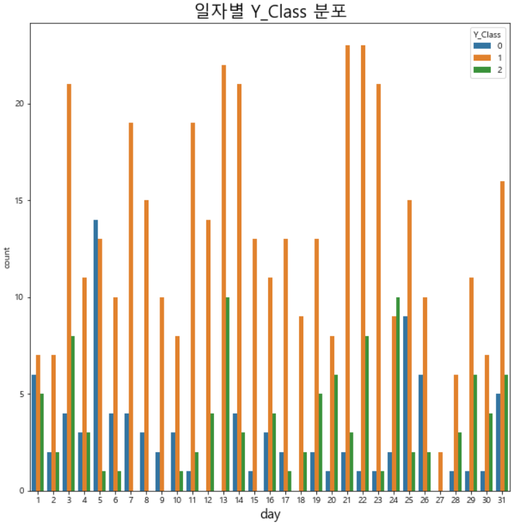
<br>

#### 시간 별 분포
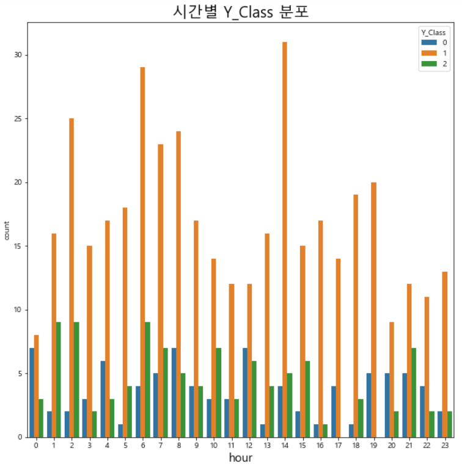
<br>

#### 분 단위 별 분포
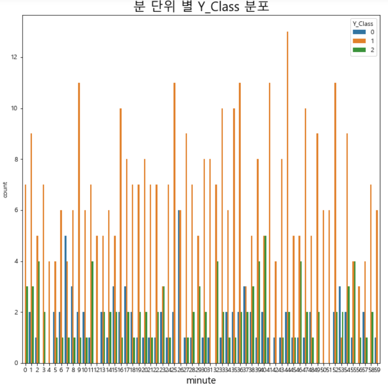
<br>

### LINE(제품이 들어간 공정 LINE 종류) 분포
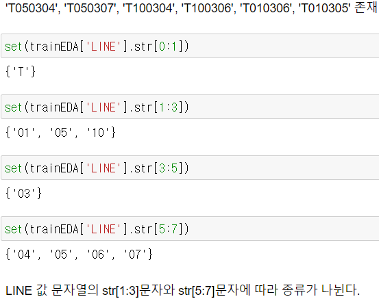
<br>

#### LINE_str[1:3]문자 별 분포
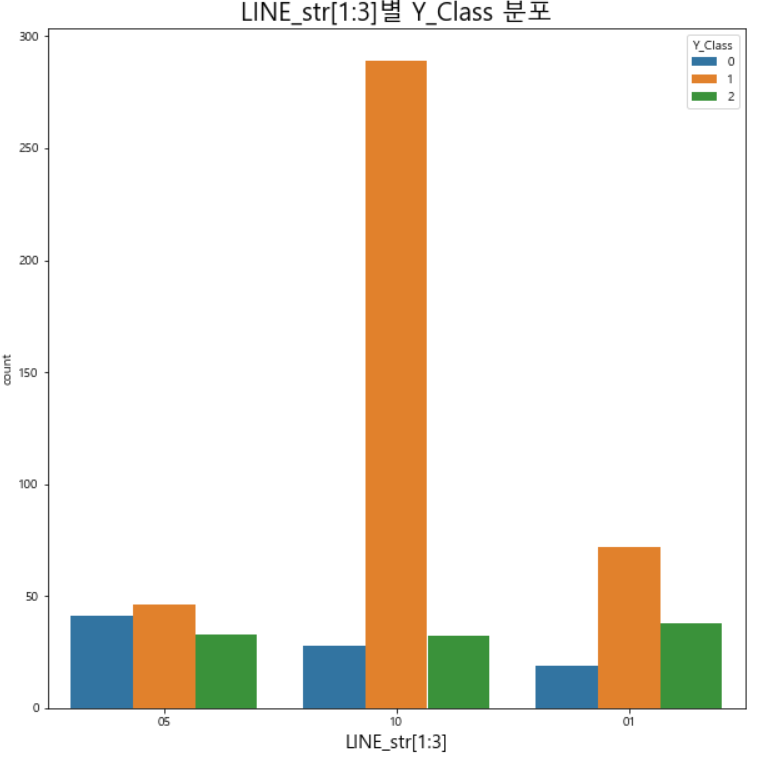
<br>

#### LINE_str[5:7]문자 별 분포
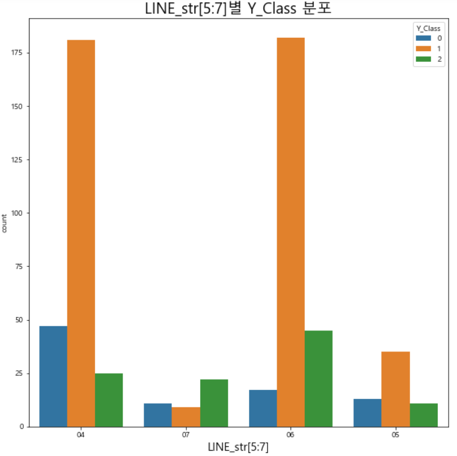
<br>

### LINE 별 분포
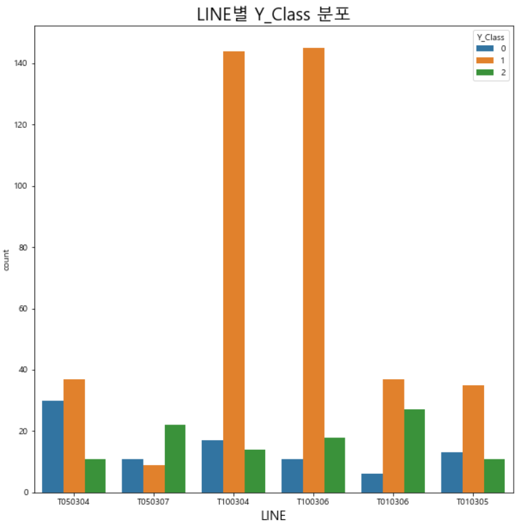
<br>

### PRODUCT_CODE (제품의 CODE 번호) 분포
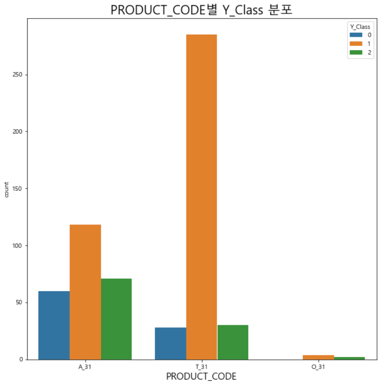
<br>

### LP(LINE-PRODUCT_CODE) 분포
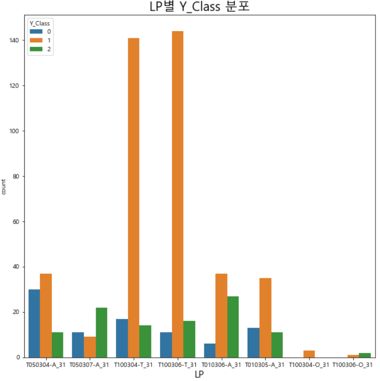
<br>

## 전처리
```python
# 파생변수 생성
def 파생변수생성(data):
    df = pd.DataFrame()
    data['TIMESTAMP'] = pd.to_datetime(data['TIMESTAMP'])
    df['day'] = data['TIMESTAMP'].dt.day
    df['hour'] = data['TIMESTAMP'].dt.hour
    df['minute'] = data['TIMESTAMP'].dt.minute
    df['LINE_first'] = data['LINE'].str[1:3]
    df['LINE_Last'] = data['LINE'].str[5:7]
    df['LP'] = data['LINE']+'-'+data['PRODUCT_CODE']
    df_concat = pd.concat([df, data], axis = 1)

    return df_concat


# 결측치 처리 및 필요없는 변수 제거
# 결측치를 0으로 채움.
trainp = trainp.fillna(0)
testp = testp.fillna(0)

trainp = trainp.drop(['PRODUCT_ID','TIMESTAMP','Y_Class','Y_Quality'],axis=1)
testp = testp.drop(['PRODUCT_ID','TIMESTAMP'],axis=1)


# Label Encoding
LE_col = ['LINE', 'PRODUCT_CODE','LP']

for i in LE_col:
    le = LabelEncoder()
    le = le.fit(trainp[i])
    trainp[i] = le.transform(trainp[i])
    testp[i] = le.transform(testp[i])
```
<br>

## 모델링 및 학습 (CatBoost)
### CatBoostRegressor (Y_Quality로 Regression)
```python
# train/test split
X_train, X_val, y_train, y_val = train_test_split(trainp, train['Y_Quality'], test_size = 0.2, shuffle = True,random_state = 42)


# 최적 hyperparamter (Optuna)
sampler = TPESampler(seed=10) #Tree-structured Parzen Estimator(Optuna Default값)

def objective(trial):
# Objective Funciton은 일반적으로 Loss나 Metric을 의미하며, HyperParameter에 따라 결과값이 변화한다.
# Function안에 모델 학습과정을 Wraping하고 Metric을 반환한다.

    cbrm_param = { # Parameter Space
        'iterations':trial.suggest_int("iterations", 1000, 20000), 
        'od_wait':trial.suggest_int('od_wait', 500, 2300), #
        'learning_rate' : trial.suggest_uniform('learning_rate',0.01, 1), 
        'reg_lambda': trial.suggest_uniform('reg_lambda',1e-5,100),
        'subsample': trial.suggest_uniform('subsample',0,1),
        'random_strength': trial.suggest_uniform('random_strength',10,50), 
        'depth': trial.suggest_int('depth',1, 15),
        'min_data_in_leaf': trial.suggest_int('min_data_in_leaf',1,30),
        'leaf_estimation_iterations': trial.suggest_int('leaf_estimation_iterations',1,15),
        'bagging_temperature' :trial.suggest_loguniform('bagging_temperature', 0.01, 100.00),
        'colsample_bylevel':trial.suggest_float('colsample_bylevel', 0.4, 1.0),
    }
# Trial은 사전에 정의된 Parameter Space에서 HyperParameter를 Sampling한다.
# 각 HyperParameter에 따른 Objective Function 결과값을 비교해 최적의 HyperParameter를 찾아낸다.
# object를 이용해 HyperParmater를 Suggest한다.(Sampling)
# suggest_int(name, low, high) : 범위 내의 정수형 값을 선택한다.
# suggest_uniform(name, low, high) : 범위 내의 이산 균등 분포를 값으로 선택한다.
# suggest_float(name, low, high) : 범위 내의 소수형 값을 선택한다.

#iterations(반복) : 1-epoch를 마치는데 필요한 미니배치 갯수
#learning_rate(학습률) : gradient의 방향으로 얼마나 빠르게 이동할 것인지 결정하는 변수
#reg_lambda : L2 정규화(규제) 파라미터
#subsample : 각각의 스탭마다 사용할 샘플의 비율. 1 이하의 값을 사용하면 오버 피팅을 방지할 수 있다.
#random_strength : 점수를 매기는 데 사용할 무작위성의 양은 트리 구조를 선택할 때 분할됩니다. 이 파라미터를 사용하면 모델이 과적합되지 않도록 할 수 있습니다.
#depth : 트리의 깊이
#min_data_in_leaf : 리프에 있는 훈련 샘플의 최소 갯수
#bagging_temperature : 베이지안 부트스트랩의 설정을 정의
#colsample_bylevel : 각각의 트리 depth 마다 사용할 칼럼(Feature)의 비율
    
    model_cbrm = CatBoostRegressor(**cbrm_param)
    model_cbrm = model_cbrm.fit(X_train, y_train, eval_set=[(X_val, y_val)], 
                           verbose=0, early_stopping_rounds=25)
# eval_set : 검증 세트 지정
# verbose : 학습 중 출력되는 문구를 설정
# - 0 : 아무 것도 출력하지 않습니다.
# - 1 : 훈련의 진행도를 보여주는 진행 막대를 보여줍니다.
# - 2 : 미니 배치마다 손실 정보를 출력합니다.
# early_stopping_rounds : 조기 중단을 위한 라운드를 설정

    MSE = mean_squared_error(y_val, model_cbrm.predict(X_val))
    return MSE
# MSE(Mean Squared Error) : 평균제곱오차, 오차(error)를 제곱한 값의 평균

optuna_cbrm = optuna.create_study(direction='minimize', sampler=sampler)
# Study는 Objective Function을 최적화 하려는 세션을 자체를 의미하며, 수 많은 Trial의 집합으로 이루어져있다.
# object를 만들고 Optimization을 실행한다.
# direction='minimize' : MSE를 최소화하는 방향으로 하이퍼 파라미터를 최적화한다.
optuna_cbrm.optimize(objective, n_trials = 20)
#n_trials : 몇 회의 trial을 수행할지 설정


cbrm_trial = optuna_cbrm.best_trial
cbrm_trial_params = cbrm_trial.params
print('Best Trial: score {},\nparams {}'.format(cbrm_trial.value, cbrm_trial_params))
#objective의 return값이 가장 "minimize"된 경우의 MSE값과 파라미터 값


# 모델학습
# Class의 비율이 다르기 때문에 StratifiedKFold (클래스 불균형으로 인한 과대적합 방지)
# 10-fold Cross-validation 진행(모델의 안정성을 위함)
cbr = CatBoostRegressor(**cbrm_trial_params, verbose=100) #최적화된 파라미터 입력
# verbose=100 : 100회 실행될 때마다 결과 값을 출력
skf = StratifiedKFold(n_splits=10,shuffle=True,random_state=42) 

# StratifiedKFold
# - 불균형한 분포도를 가진 레이블 데이터 집합을 위한 KFold 방식
# - target에 속성값의 개수를 동일하게 하게 가져감으로써 KFold 같이 데이터가 한 곳으로 몰리는 것을 방지한다.
# n_splits : n(K)개의 데이터 폴드 세트 설정

result_quality = 0 # Regressor로 나타내는 Y_Quality
best_score_r = 0 # 최소화되는 RMES 값
feature_importance_quality = 0 # 변수중요도

for train_idx,valid_idx in skf.split(trainp,train['Y_Class']):
    
    x_train = trainp.iloc[train_idx]
    x_valid = trainp.iloc[valid_idx]
    
    y_train = train['Y_Quality'].iloc[train_idx]
    y_valid = train['Y_Quality'].iloc[valid_idx]
    # train data와 valid data를 9:1 비율로 나누어 학습
    # 돌아가면서 10번의 학습과 검증을 진행한다.
    
    cbr.fit(x_train,y_train,eval_set=(x_valid,y_valid),early_stopping_rounds=100)
    result_quality += cbr.predict(testp)/10 # n_splits : 10으로, 10번의 학습과 검증을 통한 예측값의 평균을 구한다.
    best_score_r += cbr.best_score_['validation']['RMSE']/10 #검증 데이터를 통한 평균 RMSE
    feature_importance_quality += cbr.feature_importances_/10 # 학습할 때 변수중요도 저장됨.


print(f'검증 데이터를 통한 평균 RMSE :{best_score_r}')
```
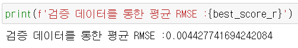
<br>

### CatBoostClassifier (Y_Class로 Classification)
```python
# optuna+CatBoostClassifier가 시간이 엄청 오래 걸려서 optuna 진행 X
cbc = CatBoostClassifier(iterations=1000,task_type='GPU', verbose=100)
# task_type : 학습에 사용할 처리 단위 유형
# verbose=100 : 100회 실행될 때마다 결과 값을 출력
skf = StratifiedKFold(n_splits=10,shuffle=True,random_state=100)
# 데이터의 개수는 적은데 정답 클래스의 종류는 3개로 많음. 
# n_splits를 크게 해서 최대한 다양한 클래스를 학습하게 하는 것이 좋음.

result_cbc = 0 # Classifier로 나타내는 Y_Class 확률값
best_score_c = 0 # 정확도
feature_importance = 0 # 변수중요도

for train_idx,valid_idx in skf.split(trainp,train['Y_Class']):
    
    x_train = trainp.iloc[train_idx]
    x_valid = trainp.iloc[valid_idx]
    
    y_train = train['Y_Class'].iloc[train_idx]
    y_valid = train['Y_Class'].iloc[valid_idx]   
    # train data와 valid data를 9:1 비율로 나누어 학습
    # 돌아가면서 10번의 학습과 검증을 진행한다.
    
    cbc.fit(x_train,y_train,eval_set=(x_valid,y_valid),early_stopping_rounds=100)
    result_cbc += cbc.predict_proba(testp)/10 #각 클래스의 확률을 예측
    best_score_c += cbc.best_score_['validation']['MultiClass']/10 #검증 데이터를 통한 정확도
    feature_importance += cbc.feature_importances_/10 # 학습할 때 변수중요도 저장됨.


print(f'검증 데이터를 통한 평균 정확도 :{best_score_c*100:.2f}%')
```
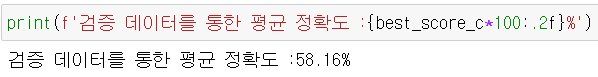
<br>

## 평가 및 비교 (Regression vs Classification)
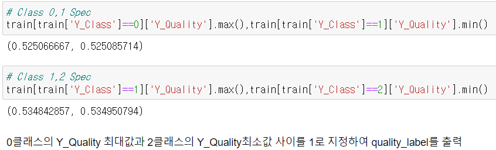
<br>

```python
## regression vs classification
result_df = pd.DataFrame(result_cbc,columns=['0_class','1_class','2_class']) #제품 품질 상태(Target)
result_df['quality'] = result_quality #CatBoostRegressor (Y_Quality로 Regression)
result_df['quality_label'] = result_df['quality'].apply(lambda x: 0 if x <0.525066667 else 2 if x>0.534950794 else 1)
result_df['class_label'] = result_cbc.argmax(1) #CatBoostClassifier (Y_Class로 Classification), .argmax(1) : 각 행별로 최대값의 인덱스 출력
result_df
```
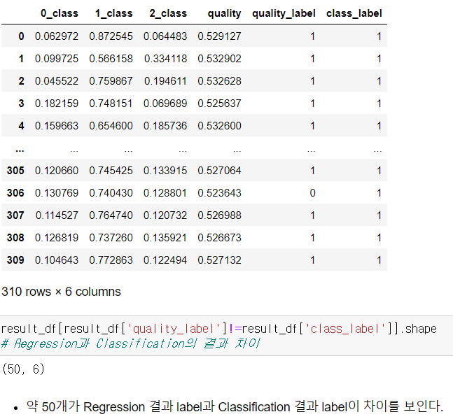