# Lgbm+ExtraTree+RF를 활용한 분류모델 앙상블
## Load library
```python
# basic library
import pandas as pd
import random
import os
import numpy as np
import warnings
import time
import datetime

# option library
warnings.filterwarnings('ignore')

# preprocessing library
from sklearn.preprocessing import LabelEncoder
from sklearn.preprocessing import MinMaxScaler

# model library
from sklearn.ensemble import VotingClassifier
from sklearn.ensemble import ExtraTreesClassifier, RandomForestClassifier
from sklearn.model_selection import GridSearchCV
from sklearn.model_selection import KFold
import lightgbm as lgb

# metrics library(평가지표)
from sklearn.metrics import accuracy_score
from sklearn.metrics import log_loss
from sklearn.metrics import classification_report

# validation library(검증)
from sklearn.model_selection import cross_val_score
from sklearn.model_selection import cross_val_predict
from sklearn.model_selection import cross_validate

# optuna library
import optuna
from optuna.samplers import TPESampler
from sklearn.model_selection import train_test_split
```
<br>

```python
# Seed 고정
def seed_everything(seed):
    random.seed(seed)
    os.environ['PYTHONHASHSEED'] = str(seed)
    np.random.seed(seed)
seed_everything(37) 
```
## Load Data
```python
train_df = pd.read_csv('../train.csv')
test_df = pd.read_csv('../test.csv')
```
* Columns
 - Y_class : 제품 품질 상태(Target)
   + 0 : 적정 기준 미달 (부적합)
   + 1 : 적합
   + 2 : 적정 기준 초과 (부적합)
 - Y_Quality : 제품 품질 관련 정량적 수치
 - TIMESTAMP : 제품이 공정에 들어간 시각
 - LINE : 제품이 들어간 공정 LINE 종류  ('T050304','T050307','T100304','T010306','T010305')
 - PRODUCT_CODE : 제품의 CODE 번호('A_31', 'T_31', 'O_31')
 - X_1 ~ X_2875 : 공정 과정에서 추출되어 비식별화된 변수

## 데이터 확인
#### train데이터


#### test데이터


#### 데이터 공정라인과 제품번호 확인


## Data PreProcessing
```PYTHON
# test data와 train data 에서 분류할 colums LINE,PRODUCT_CODE,X데이터만 남김
test_x = test_df.drop(columns = ['PRODUCT_ID','TIMESTAMP'])
train_x = train_df.drop(columns = ['PRODUCT_ID','TIMESTAMP','Y_Class','Y_Quality'])
# Train데이터에서 분류된 Y_Class train_y
train_y = train_df['Y_Class']
```
</img></img>

#### Label Encoding
```PYTHON
qual_col = ['LINE','PRODUCT_CODE']
for i in qual_col:
    le = LabelEncoder()
    le = le.fit(train_x[i])
    train_x[i] = le.transform(train_x[i])
    
    for label in np.unique(test_x[i]): 
        if label not in le.classes_: 
            le.classes_ = np.append(le.classes_, label)
    test_x[i] = le.transform(test_x[i]) 
```
- qualitative to quantitative : 정성적 데이터(비정형데이터, 문자나 언어의 텍스트 파일)을 정량적 데이터로 수치화하는 전처리 작업
- le.fit() : 학습 시 고유 피처들을 학습하여 고유번호를 지정
- le.transform() : 각 피처값을 해당하는 학습된 고유값으로 변환
- .classes_ : 고유번호 0번부터 고유값에 대한 원본 데이터 값을 가지고 있음
- np.append(대상 어레이,추가할 값, 파라미터축)

</img> </img>

#### 정규화
```PYTHON
#.columns.str.contains("a") : a라는 문자가 들어있는 문자열 모두 찾음
x_col = train_x.columns[train_x.columns.str.contains('X')].tolist()

scaler = MinMaxScaler()
scaler.fit(train_x[x_col])
  
train_x[x_col] = scaler.transform(train_x[x_col])
test_x[x_col] = scaler.transform(test_x[x_col])
```
</img> </img>

#### 결측값(NaN) 평균으로 채우기
```PYTHON
# mean 연산시 nan값은 분석 대상에서 제외
train_x = train_x.fillna(train_x.mean())
test_x = test_x.fillna(train_x.mean())
```
</img>

#### 전체 결측값(Null)인 변수 X Drop하기
```PYTHON
# 결측값있는 열 전체 삭제
train_x = train_x.dropna(axis =1)
test_x = test_x.dropna(axis=1)
```
 &rarr; </img></img>
## Modeling
```PYTHON
train_x.shape, train_y.shape, test_x.shape
```
</img>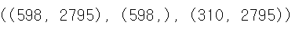</img>
#### RandomForestClassifier
<details>
<summary>랜덤 포레스트란?</summary>

> 랜덤 포레스트란?
> - 하나의 결과에 도달하기 위해 여러 의사결정 트리의 출력을 결합하는것.
> - 주제에 대한 다양한 질문들은 트리의 의사결정 노드를 구성하며 데이터를 분할하는 수단 역할을 수행한다.
>> 의사결정 트리
>> - 최종 의사결정은 잎새 노드(leaf node)로 표시된다.
>> - 의사결정 트리는 데이터의 하위 집합을 만들기 위해 최적의 분할 지점을 찾고자하며, 일반적으로 분류 및 회귀 알고리즘을 통해 훈련되다.
>> - 의사결정 트리는 일반적인 지도형 학습 알고리즘이지만, 편향 및 과대적합과 같은 문제가 발생 할 수도 있다.
>> - 여러 의사결정 트리가 랜덤 포레스트 알고리즘에서 앙상블을 형성하면, 더 정확한 결과를 예측하게된다.(특히 상관관계가 없는 경우)
> * * *
>> 앙상블 방법
>> - 앙상블 : 머신러닝을 다양한 학습 알고리즘들을 결합하여 학습시키는 것을 말한다.
>> - 앙상블의 학습 방식은 의사결정 트리와 같은 분류자의 모음으로 구성된다.
>> - 예측을 집계하여 가장 인기있는 결과를 찾아내는 것.
>> - 앙상블 기법으로는 배깅(Bagging), 부스팅(Boosting) , 스태킹(Stacking) 등이 있다.
>>> bagging(bootstrap aggreagting)
>>> - 부트 스트랩을 병렬 복원추출로 집계하는것.
>>>> 부트스트랩 : random sampling을 적용하는 방법을 일컫는 말이다.
>>>> - (raw data의 분포 추정) 측정된 데이터 중에서 중복을 허용한 복원 추출로 n개를 뽑고, 뽑은 n개의 평균을 구하는 것을 m번 반복하여 모으게 되면 평균에 대한 분포를 구할 수 있게 되고, 이로부터 sample mean에 대한 신뢰 구간을 추정할 수 있게 되는 것이다.
>>>> - 머신러닝에서 random sampling을 통해 training data를 늘릴 수 있다.
>>> - 배깅(bagging)은 부트스트랩(bootstrap)을 집계(Aggregating)하여 학습데이터가 충분하지 않더라도 충분한 학습 효과를 주어 bias의 underfitting문제나, 높은 variance로 인한 overfitting 문제 해결에 도움을 준다.<br>
>>> <p align="center"></img>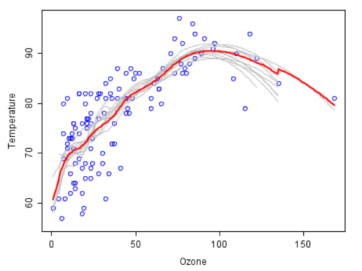</img></p><br>

>>> - 일반적으로 categorical data의 경우 투표로 집계, continuous data의 경우 평균으로 집계된다.
>>> ***
>>> 부스팅(Boosting)
>>> - 순차적으로, 복원추출로 가중치를 준다.
>>> - 부스팅의 경우 bagging과 크게 다르지 않으며 거의 동일한 매커니즘을 갖고 있다.
>>> - bagging과는 다르게 순차적으로 학습이 진행되는 것이다. bagging의 경우 각각의 분류기들이 학습시 상호영향을 주지 않아 병렬적으로 학습이 끝난 다음 결과를 종합하는 기법이라면, Boosting은 이전 분류기의 학습 결과를 토대로 다음 분류기의 학습 데이터의 샘플 가중치를 조정해 학습을 진행하는 방법이다.
>>> - 오답에 대해 높은 가중치를 주기 때문에 정확도가 높게 나오는 대신 outlier(이상치:관측된 데이터의 범위에서 많이 벗어난 아주 작은 값이나 큰 값을)에 취약하다.
>>> - boosting 기법 예로는 XGBoost, GradientBoost,LGBM등이 존재한다.
>>> * * *
>>> 스태킹(stacking)
>>> - 크로스 벨리데이션(Cross Validation) 기반으로 서로 상이한 모델들을 조합하는 것.
>>> <p align="center"></img>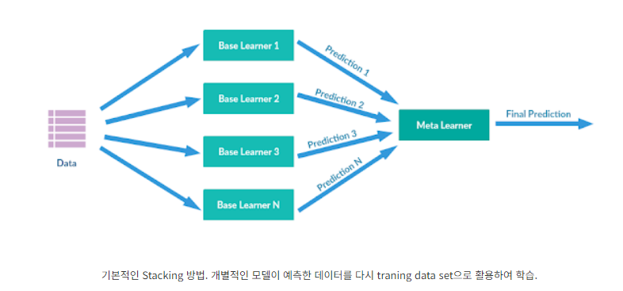</img></p><br>

>>> - 기본적으로 개별 모델이 예측한 데이터를 다시 meta data set으로 사용해서 학습하는 컨셉이다.
>>> - base learner(기본 학습자)들이 동일한 데이터 원본을 가지고 학습하면 overfitting 발생한다.// bagging과 bootsting에서 bootstrap(데이터 랜덤샘플링)과정을 통해 overfitting 방지하는 것과 대조적이다.
>>> - 크로스 밸리데이션으로 데이터를 쪼개 학습한다.
>>>> 크로스 벨리데이션(CV)이란, data set을 k번 쪼개서 반복적으로 쪼갠 data를 train과 test에 이용하여(k-fold cross validation) 교차 검증을 하는 것이다. (보통 10-fold cross validation이 안정적이다)
>>>> 1.  Base Learner들은 원본 데이터를 각 fold별로 쪼개어 train set을 이용하여 학습한다.
>>>> (예를 들어, 4-fold CV의 경우 한 fold 마다 2개의 train set, 1개의 validation set, 1개의 test set이 생성.)
>>>> 2. Base Learner들은 각 fold 마다 학습한 모델을 validation set에서 계산한 결과를 모으고, test set을 이용한 예측값은 평균을 내어 meta 모델에 사용하는 하나의 test set으로 만든다.<br>
(만약 3개의 Base Learner를 사용한다면, Base Learner들은 각각 3개의 validation set와 1개의 test set이 존재한다.)
>>>> 3. 결과적으로, 모든 Base Learner의 validation set와 test set을 모아 meta train set와 meta test 셋으로 활용하여 학습한 뒤, 최종 모델을 생성한다.<br>
(4-fold CV의 경우 총 9개의 validation set를 meta train set로, 3개의 test set를 meta test set로 사용)
>>> - CV 기반으로 Stacking을 적용함으로써 overfitting은 피하며 meta 모델은 '특정 형태의 샘플에서 어떤 종류의 단일 모델이 어떤 결과를 가지는지' 학습할 수 있게된다.

>> 랜덤 포레스트 알고리즘
>> - 랜덤 포레스트 알고리즘은 배깅 방법의 확장으로, 배깅과 특성 무작위성을 모두 활용하여 상관관계가 없는 의사결정 트리의 포레스트를 만드는 것이다.
>> - 무작위로 특성의 하위 집합을 생성하여 의사결정 트리 간에 낮은 상관관계가 존재하도록 한다. 
>> - 이것이 의사결정 트리와 랜덤 포레스트의 주된 차이점이다. 의사결정 트리는 가능한 모든 특성 분할을 고려하는 반면, 랜덤 포레스트는 이러한 특성의 하위 집합만을 선택한다.<br>

>> 운영 방법
>> 1. 훈련전 세 개의 주요 하이퍼파라미터 노드 크기, 트리의 수, 샘플링된 특성의 수를 설정해야한다.
>> - 랜덤 포레스트 알고리즘은 다수의 의사결정 트리로 구성되며 앙상블의 각 트리는 복원 추출 방식으로 훈련 세트에서 추출된 데이터 샘플(이를 부트스트랩 샘플이라고 부름)로 구성된다.
>> 2.  훈련 샘플 중에서 1/3은 테스트 데이터로 떼어 놓습니다. 이러한 데이터를 아웃오브백(out-of-bag, oob) 샘플이라고 한다.
>> 3. 무작위성의 또 다른 인스턴스는 특성 배깅을 통해 주입.
>> - 데이터 세트에 다양성을 추가하고 의사결정 트리 간의 상관관계를 감소
>> 4. 문제의 유형에 따라 예측에 대한 결정이 달라진다.
>> - 회귀 작업 : 개별 의사결정 트리는 평균을 구하며
>> - 분류 작업 : 다수결 보트(majority vote), 즉 가장 빈번한 범주적 변수에 따라 예측된 클래스를 내놓는다.
>> 5. oob 샘플이 교차 검증을 위해 사용되고 예측이 완료된다.
<p align="center"></img>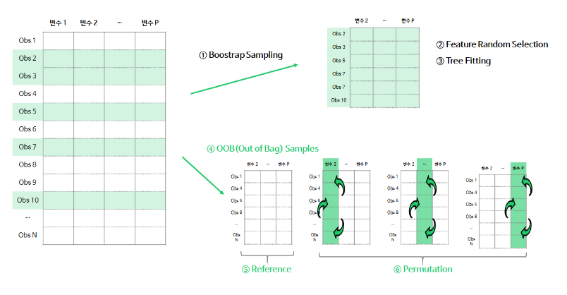</img></p><br>

1. (①~③) b번째 tree를 생성할 때, bootstrap sample로 나무를 학습
2. (④) OOB Samples : 학습할 때 사용되지 않은 데이터 셋으로 Validation 데이터를 생성
3. (⑤) Reference Measure : OOB Sample로 나무의 예측력(accuracy, R-square, MSE 등)을 계산 및 저장
4. (⑥) Permutation Measure : OOB Sample에서 j번째 변수의 데이터를 무작위로 섞은 뒤, 학습된 나무의 예측력을 계산 및 저장
5. ⑤, ⑥단계에서 저장된 예측력 척도의 차이(Reference Measure - j번째 변수의 Permutation Measure)를 계산
</details>

```PYTHON
start = time.time() # 시작
params = {
    'n_estimators':[500, 1000, 1500, 2000, 2500, 3300],
    'max_depth' : [5, 6, 8, 10, 12], 
    'min_samples_leaf' : [5, 6, 7, 8, 9],
    'min_samples_split' : [6, 7, 8, 9, 10, 12]
}
rf_cls = RandomForestClassifier(random_state = 37, n_jobs = 1)
grid_cv = GridSearchCV(rf_cls, param_grid = params, cv = 2, scoring = 'accuracy',n_jobs=1, verbose =2 )
grid_cv.fit(train_x, train_y)

# 최적의 파라미터 모델을 이용하여 예측값 생성
grid_estimator = grid_cv.best_estimator_
rf_pred = grid_estimator.predict(test_x)
# 후보 파라미터 성능 검증 결과 출력
print('최적 하이퍼 파라미터:\n', grid_cv.best_params_)
print('최고 예측 정확도: {0:.4f}'.format(grid_cv.best_score_))
sec = time.time()-start # 종료 - 시작 (걸린 시간)
times = str(datetime.timedelta(seconds=sec))
short = times.split(".")[0] # 초 단위 까지만
print(f"{times} sec")
print(f"{short} sec")
```
</img>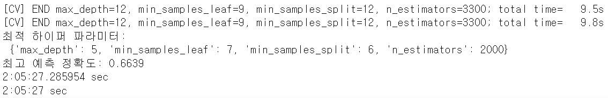</img>
- n_jobs : 모델 학습 및 예측에 사용되는 병렬 작업의 수 -1의 경우 cpu의 모든 코어 사용
- n_estimators : 생성할 트리의 개수(default = 100)
- min_samples_leaf : 노드를 분할하기 위해 리프 노드가 가져야 할 최소한의 샘플 개수 
  > 값을 작게 설정하면 모델 복잡성 증가:과적합 위험 값을 증가 시키면 모델의 편향은 증가하고 분산은 감소. 모델의 복잡도가 낮아지지만 일부 손실 발생
- min_samples_split : 노드를 분할 하기 위해 필요한 최소한의 샘플 개수
  > 샘플 수가 이보다 작아지면 분할하지 않고 리프 노드로 설정 // 값이 작을 수록 복잡성 증가. 데이터 작은 변동에 민감반응 과적합위험.
- max_features : 노드를 분할 할 때 고려 할 특성의 무작위 하위 집합의 크기
  > 값이 작으면 분산 감소, 편향증가, 복잡도 감소 , 모델 성능 감소
- max_depth = 트리의 최대 깊이(defualt = none) : 깊이가 제한된 트리는 각각의 결정 경계를 더 간단하게 만듬. 모델 과적합 방지
  > 값이 작으면 모델의 단순성을 증가. 분산감소 편향 증가 => 데이터의 다양한 패턴 잡아내지 못하고 일반화 능력 향상됨
- feaure_importances_ : 랜덤포레스트는 다수의 의사결정 트리 앙상블하여 모델 구성. 각 피처들을 사용하여 분할 수행하고 이 과정에서 피처들의 중요도 계산

- best_estimator : gridsearchCV 객체에서 최적의 추정기(estimator)를 반환하는 속성

#### OOF(Out Of Fold) prediction & LGBMClassifier
<details>
<summary>OOF+LightGBM+Optuna 란?</summary>

> LightGBM
>> GBM<br>
>> 여러 개의 약한 학습기를 순차적으로 학습-예측하며 잘못 예측한 데이터에 가중치 부여를 통해 오류를 개선하면서 학습
> - Tree 자료 구조를 기초로 한 gradient boosting framework이다.
> - Leaf-wise Tree Growth 구조를 택하기 때문에 Level-wise Tree Growth 구조인 XGBoost 보다 속도가 빠르다.
>   * Level(균등, 수평) wise(분할) 방식은 tree를 수평적으로 키운다. 따라서 tree를 균형적으로 만들기 위한 추가 연산이 필요하기 때문에 상대적으로 속도가 느리다.<br><br>
>   * 반면 Leaf wise 방식은 delta loss가 가장 큰 값을 선택하여 다시 subtree로 분할하는 것이다. 즉 성능을 가장 낮추는(loss가 가장 큰) node를 선택해 loss를 줄여나가는 방식이다. 따라서 상대적으로 속도가 빠르고 예측 오류를 최소화할 수 있다.
> - 10000만건 이하의 데이터로 학습 시 overfitting 가능성 높다. ->  leaf-wise는 과적합(overfitting)이 되기 쉬우므로 max_depth를 줄여줘야 한다.
>> LightGBM 장점
>> - XGBoost 보다 학습에 걸리는 시간이 훨씬 적음
>> - 메모리 사용량도 상대적으로 적음
>> - 카테고리형 피처의 자동 변환, 최적 분할 (원-핫 인코딩 없이도 카테고리형 피처를 최적으로 변환하고, 이에 따른 노드 분할)
>> - 대용량 데이터에 대한 뛰어난 예측 성능 및 병렬 컴퓨팅 제공
>> - 최근에는 GPU까지 지원
XGBoost와 예측 성능에 큰 차이가 없음, 오히려 기능상의 다양성은 LightGBM이 더 많음
>> <p>다른 GBM 계열과 차이점<p>
>> <p align="center"></img>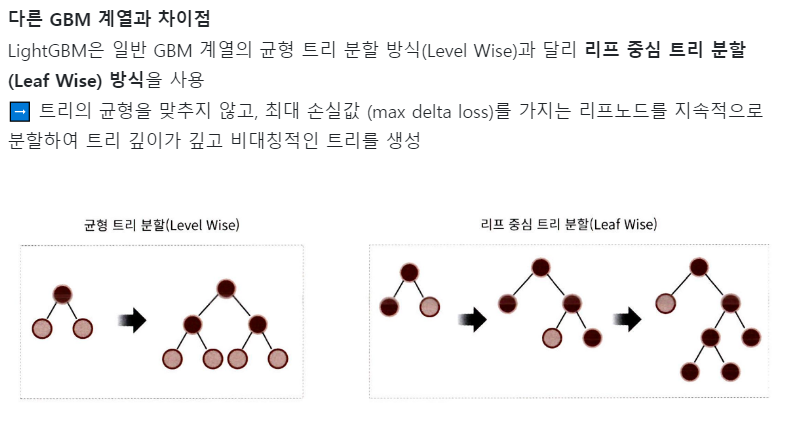</img></P>

> OOF (Out Of Fold) prediction
> - K-fold 교차검증과 같은 방식이다
>> 데이터수가 적을 때 모델의 오버피팅 가능성을 예방하기 위해 자주 사용되는 교차검증 방법인 K-FOLD cross validation에서도 fold가 사용된다.
> <p align="center"></img>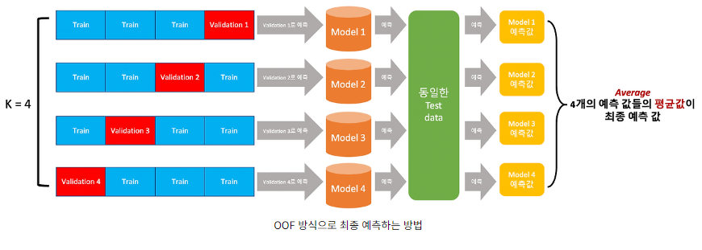</img></P><br>

> - 동일한 하이퍼 파라미터를 사용한 예측 알고리즘으로 각 검증 데이터로 평가한 모델 1~4을 생성한다.
> - 생성된 모델들을 동일한 테스트데이터에 예측하게하여 각 모델별 예측값을 도출한다.
> - 예측된 모델들의 값을 평균값 취하여 최종 예측값을 계산한다.

> OPTUNA
> - GridSearchCV 패키지는 시간이 오래걸리고 하이퍼 파라미터를 지정해줘야 하지만 optuna는 보다 러프하게 값을 지정해주면 자동탐색 기능을 통해 최적의 하이퍼파라미터를 도출해주고 시간이 적게 걸린다.
>> Optuna는 study와 trial을 다음과 같이 정의한다.
>> - Study: objective 함수에 기반하여 optimization을 수행하는 하나의 프로젝트
>> - Trial: Study 내의 optimization 단일 수행
</details>

> 검증데이터 학습데이터 분리
```PYTHON
t_train_xx,t_valid_xx,t_train_yy,t_valid_yy = train_test_split(train_x,train_y,test_size = 0.2, shuffle = True, random_state=42)
```
</img>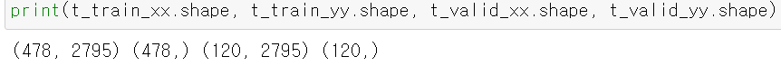</img>
> OPTUNA를 이용한 최적 하이퍼파라미터 찾기
```PYTHON
from optuna.samplers import TPESampler
sampler = TPESampler(seed = 10)
def objective(trial):
    dtrain = lgb.Dataset(t_train_xx, label = t_train_yy)
    dtest = lgb.Dataset(t_valid_xx, label = t_valid_yy)
    param = {
        'objective': 'multiclass', # 분류
        'verbose': -1,
        'metric': 'multi_logloss', #평가지표
#       'metric': 'rmse', # 회귀모델 평가지표 
        "reg_alpha": trial.suggest_float("reg_alpha", 1e-8, 3e-5), 
        "reg_lambda": trial.suggest_float("reg_lambda", 1e-8, 9e-2),
        "num_leaves": trial.suggest_int("num_leaves", 2, 256), 
        'max_depth': trial.suggest_int('max_depth',3, 15), 
        'learning_rate': trial.suggest_loguniform("learning_rate", 1e-8, 1e-2), 
        'n_estimators': trial.suggest_int('n_estimators', 100, 3000),
        'min_child_samples': trial.suggest_int('min_child_samples', 5, 100), 
        'subsample': trial.suggest_loguniform('subsample', 0.4, 1),
        'colsample_bytree': trial.suggest_float("colsample_bytree", 0.4, 1.0),
    }
    
    model_lgb = lgb.LGBMClassifier(**param) 
    lgb_model = model_lgb.fit(t_train_xx, t_train_yy, eval_set =[(t_valid_xx, t_valid_yy)], verbose = False, early_stopping_rounds = 100)
    lgb_pred = lgb_model.predict_proba(t_valid_xx)
    log_score = log_loss(t_valid_yy,lgb_pred)
    return log_score
study_lgb = optuna.create_study(direction='minimize',study_name="lgbm_parameter_opt", sampler=sampler)
study_lgb.optimize(objective, n_trials = 50)

trial = study_lgb.best_trial
trial_params = trial.params
print(f"best Trial:score{trial.value},\nparams{trial_params}")
print("Best Score:", study_lgb.best_value)
print("Best trial:", study_lgb.best_trial.params)
```
- optuna : objective와 study를 정의하고, n_trails 파라미터를 조정하여 몇 회의 trial 수행할지 설정하는 방식
- verbose : 학습 출력 결과 n_estimators 실행회수 N번마다 결과 출력
- reg_alpha : L1 Regularization parameter로 불필요한 가중치를 0으로 만든다.
- reg_lambda : L2 Regularization parameter로 불필요한 가중치를 0으로 만든다.
- num_leaves : tree의 최대 leaf node의 개수
- max_depth : 깊이 제한 하는 파라미터 깊이제한이 클수록 과적합이 발생하는 것을 방지
- suggest_int 범위 내의 정수형 값 선택 
- suggest_loguniform 범위 내의 로그 함수 선상값 선택
- subsample : boosting 단계마다 데이터를 랜덤으로 선택하는 비율. 즉 subsample 비율 만큼 데이터를 랜덤으로 선택해서 학습 진행// 값이 작으면 속도를 향상 할수 있고 overfitting방지
- colsample_bytree : boosting 단계마다 feature를 선택하는 비율이다. feature가 많거나 소수의 feature에 의존적일때 overfitting해결 할 수 있다.

- *arg는 튜플형식가변인자, **kwargs 딕셔너리 키워드 
- eval_set : 검증데이터 셋 지정
- early_stoping_rounds : 검증데이터n개를 학습기를 통해 가중치 부여하며 오류개선 -> n_estimators횟수반복 ->loss나 성능지표가 25회 동안 향상되지 않으면 조기종료
- log_loss : 분류문제의 대표적인 평가지표 교차 엔트로피라고 부르기도함. 실제 값을 예측하는 확률에 로그를 취하여 부호를 반전 시킨값. 낮을수록 좋은 지표
- study 정의 minimize: logloss를 최소화 시켜주는 방향으로 튜닝하고 싶을경우. accuracy, roc-auc 같은 경우는 최대화 시켜주는 방향으로 maximize로 설정
- optimize 최적함수 파라미터 찾는것. 즉 최적화

</img>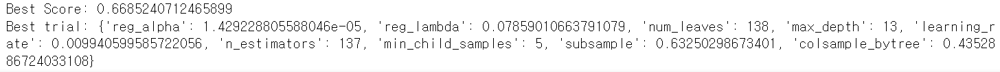</img>
> optuna를 활용한 최적의 하이퍼파라미터 시각화
<p align="center"></img>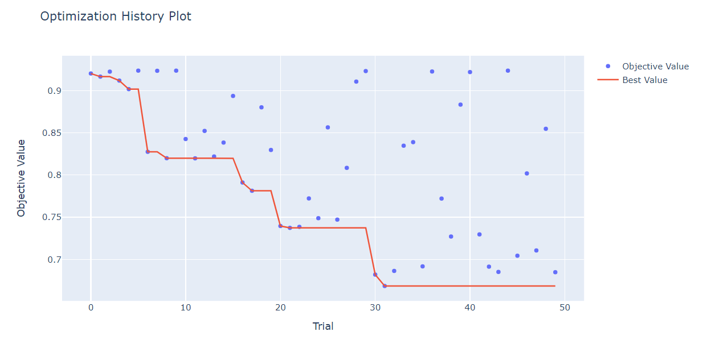</img></P>

- 파라미터들관의 관계
<p align="center"></img>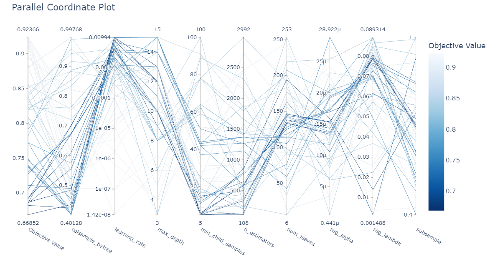</img></P>

- 하이퍼 파리미터 중요도
<p align="center"></img>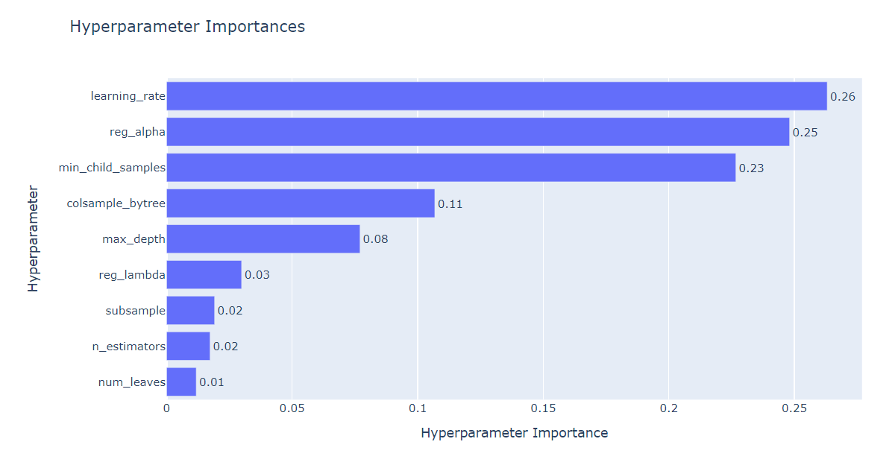</img></P>

> OOF(out of fold) prediction 4fold 학습
```PYTHON
#oof 4번학습 결과 도출
folds = KFold(n_splits = 4, shuffle = True, random_state = 37)

oof_preds = np.zeros((train_x.shape[0],3))

test_preds = np.zeros((test_x.shape[0],3))

final_lgb_model = lgb.LGBMClassifier(**trial_params)#optuna로 찾은 최적 하이퍼파라미터 적용
for fold_idx, (train_idx, valid_idx) in enumerate(folds.split(train_x)):#train_x 데이터를 count idx, 학습 검증데이터 분류 idx
    print('##### interation', fold_idx, ' 시작')
    train_xxx = train_x.iloc[train_idx, :]#분류된 train_idx 값에 맞는 데이터 저장
    train_yyy = train_y.iloc[train_idx]
    valid_xxx = train_x.iloc[valid_idx, :]
    valid_yyy = train_y.iloc[valid_idx]
    final_lgb_model.fit(train_xxx, train_yyy, eval_set=[(train_xxx, train_yyy), (valid_xxx, valid_yyy)], verbose=200, early_stopping_rounds = 200)
    oof_preds[valid_idx] = final_lgb_model.predict_proba(valid_xxx, num_iteration=final_lgb_model.best_iteration_)
    test_preds += final_lgb_model.predict_proba(test_x, num_iteration = final_lgb_model.best_iteration_)/folds.n_splits
# validation set가 n_split갯수만큼 있으므로 크기는 ftr_app의 크기가 되어야 함. 
# Ouf of Folds로 학습된 모델의 test dataset을 예측하여 결과 확률을 담을 array 생성. 
# 학습된 모델의 valitation set 을 예측하여 결과 확률을 담을 array 생성// np.zeros : 0으로 채워진 [shape] 생성
```
<p align="center"></img>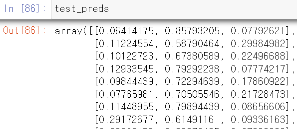</img></P>

> 예측된 0 1 2인덱스에 대한 최대값 추출
```PYTHON
lgbm_preds= []
for i in range(len(test_preds)):
     lgbm_preds.append(np.argmax(test_preds[i]))
lgbm_pred = np.array(lgbm_preds)
print(lgbm_pred)
```
<p align="center"></img>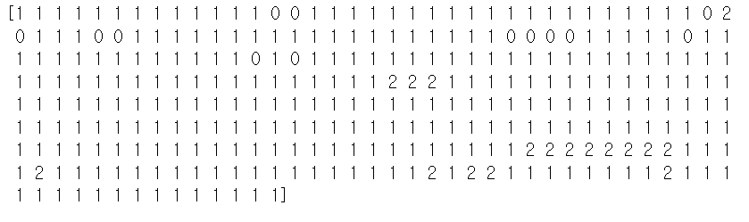</img></P>

#### ExtraTreesClassifier
<details>
<summary>ExtraTreesClassifier란?</summary>

> 분류를 위한 앙상블 학습 알고리즘 중 하나로, 무작위 디시전트리를 사용하는 방법이다.
- 랜덤 포레스트와 비슷하게 결정 트리를 사용하여 앙상블 모델을 만듭니다. 차이점은 부트스트랩 샘플을 사용하지 않는다는 점입니다. 대신 랜덤하게 노드를 분할해 과대적합을 감소시킵니다.
- 랜덤포레스트와 유사하지만 극도로 무작위화된 특징을 가진다.
- random threshold를 사용하여 더욱 랜덤한 트리를 생성하기 때문에 모델의 분산을 줄이고 오버피팅을 방지 할 수 있다.
- 극도로 무작위화(Extremely Randomized)된 기계 학습 방법
- 데이터 샘플 수와 특성 설정까지 랜덤
- 랜덤 포레스트와 동일한 원리를 이용하기 때문에 많은 특성을 공유함
- 랜덤 포레스트에 비해 속도가 빠르고 성능도 미세하게 높음
- Bootstrap 샘플링을 사용하지 않고 전체 특성 중 일부를 랜덤하게 선택해 노드 분할에 사용 → 무작위 분할 중 가장 좋은 것을 분할 규칙으로 선택
</details>

> ExtraTreesClassifier 모델 생성
```PYTHON
ex_cls = ExtraTreesClassifier(random_state=37)
```
> 교차검증사용
>> - 교차검증을 사용하면 모델의 예측 성능을 미리 예측하고, 과적합 문제를 방지 할 수 있다

>> cross_val_score : 각 검증의 평가 스코어 도출
>> <p align="center"></img>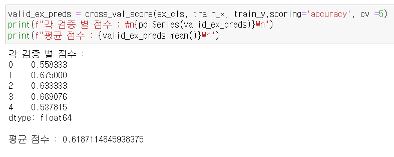</img></P>

>> cross_validate : 각 검증의 결과 도출
>> <p align="center"></img>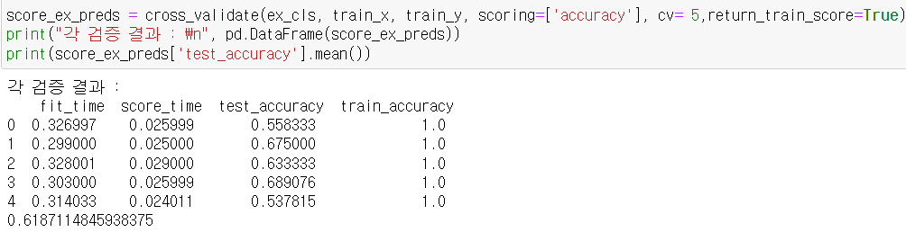</img></P>

>ExtraTreesClassifier 모델학습
```PYTHON
ex_cls.fit(train_x,train_y)
ex_preds = ex_cls.predict(test_x)
```
<p align="center"></img>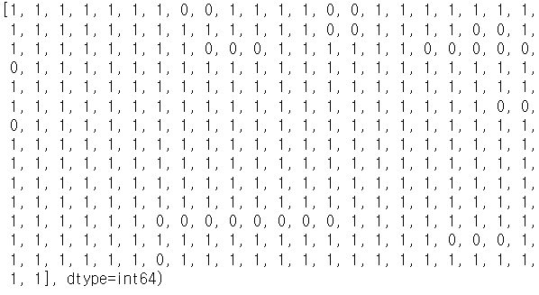</img></P>

> 모델 피처의 중요도
```PYTHON
fi = pd.Series(ex_cls.feature_importances_)
fi.index = train_x.columns
fi.sort_values(ascending=False).head(10) # 내림차순 정렬
```
<p align="center"></img>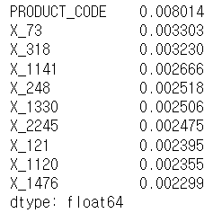</img></P>

#### 간접 투표 분류기(Soft Voting) Predict
<details>
<summary>간접 투표 분류기란?</summary>

> 투표 분류기 (Voting Classifier)
- 보팅은 앙상블 학습 중 하나로 여러 개의 분류기가 투표를 통해 최종 예측 결과를 결정하는 방식이다.
- 여기서 보팅과 배깅의 차이는 배깅은 분류기가 모두 같은 유형의 알고리즘 기반으로 데이터 샘플링을 다르게 가져가서 학습하고 보팅은 서로 다른 알고리즘을 가진 분류기를 결합하는 방식이다.
>> 하드 보팅(직접투표) & 소프트 보팅(간접 투표)
>> - 하드 보팅
>>> hard voting은 가장 높은 투표 수로 예측을 선택하는 것.
>>> <p align="center"></img>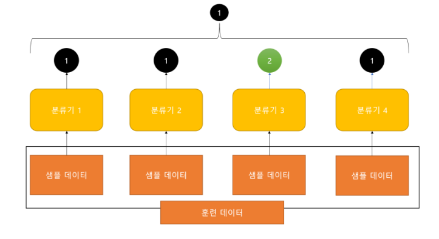</img></P>

>> - 소프트 보팅
>>> soft voting은 각 모형의 각 예측의 확률을 결합하여 가장 높은 총 확률을 갖는 예측을 선택하는 것
>>><p align="center"></img>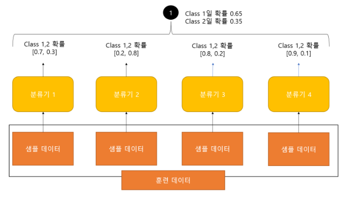</img></P>

</details>

>soft voting 할 모델 생성 및 하이퍼파라미터 입력
```PYTHON
sv_ex_cls = ExtraTreesClassifier(random_state=37)
sv_ex_cls.fit(train_x,train_y)
sv_lgb_model = lgb.LGBMClassifier(**trial_params)
sv_lgb_model.fit(train_x,train_y)
sv_rf_cls = RandomForestClassifier(**grid_cv.best_params_)
sv_rf_cls.fit(train_x,train_y)
```
> soft voting model 생성 및 학습 예측
```PYTHON
voting_clf = VotingClassifier([
    ("lgb_clf",sv_lgb_model),
    ("rf_clf",sv_rf_cls),
    ("ex_clf",sv_ex_cls)
], voting= 'soft')
voting_clf.fit(train_x,train_y)
voting_pred = voting_clf.predict(test_x)
```
<p align="center"></img>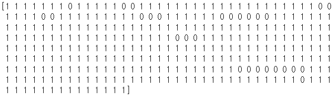</img></P>

## Submit
```PYTHON
submit = pd.read_csv('../sample_submission.csv')
```
> RandomForestClassifier_pred
```PYTHON
submit['Y_Class'] = rf_pred
submit.to_csv('./final_rf_pred.csv',index=False)
```
> LightGBMClassifier_pred
```PYTHON
submit['Y_Class'] = lgbm_pred
submit.to_csv('./final_lgbm_pred.csv',index=False)
```
> ExtraTreesClassifier_pred
```PYTHON
submit['Y_Class'] = ex_preds
submit.to_csv('./final_ex_preds.csv',index=False)
```
> Soft voting_pred
```PYTHON
submit['Y_Class'] = voting_pred
submit.to_csv('./final_voting_pred.csv',index=False)
```

## Result
## 참고자료
- https://data-analysis-science.tistory.com/61
- https://www.ibm.com/kr-ko/topics/random-forest
- https://www.ibm.com/kr-ko/topics/random-forest
- https://velog.io/@vvakki_/%EB%9E%9C%EB%8D%A4-%ED%8F%AC%EB%A0%88%EC%8A%A4%ED%8A%B8%EC%97%90%EC%84%9C%EC%9D%98-%EB%B3%80%EC%88%98-%EC%A4%91%EC%9A%94%EB%8F%84Variable-Importance-3%EA%B0%80%EC%A7%80
- https://m.blog.naver.com/fbfbf1/222484365132
- https://gogetem.tistory.com/entry/Machine-Learning-%ED%88%AC%ED%91%9C%EA%B8%B0%EB%B0%98-%EB%B6%84%EB%A5%98-%EB%AA%A8%EB%8D%B8-Voting-Classifiers-Ensemble-%EC%95%99%EC%83%81%EB%B8%94
- https://icedhotchoco.tistory.com/entry/DAY-54
- https://velog.io/@nata0919/Extra-Trees-%EC%A0%95%EB%A6%AC
- https://blog.naver.com/PostView.naver?blogId=ytlee64&logNo=222840359593&categoryNo=0&parentCategoryNo=30&viewDate=&currentPage=1&postListTopCurrentPage=1&from=search
- https://velog.io/@gchaewon/ML-4-5.-GBM-6.XGBoost-7.LightGBM
- https://techblog-history-younghunjo1.tistory.com/142
- https://bo-10000.tistory.com/202