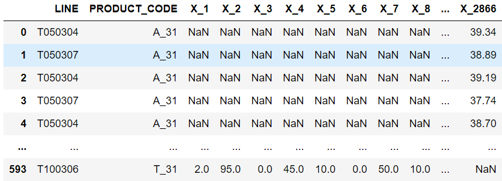

# Lgbm+ExtraTree+RF를 활용한 분류모델 앙상블
## Load library
```python
# basic library
import pandas as pd
import random
import os
import numpy as np
import warnings
import time
import datetime

# option library
warnings.filterwarnings('ignore')

# preprocessing library
from sklearn.preprocessing import LabelEncoder
from sklearn.preprocessing import MinMaxScaler

# model library
from sklearn.ensemble import VotingClassifier
from sklearn.ensemble import ExtraTreesClassifier, RandomForestClassifier
from sklearn.model_selection import GridSearchCV
from sklearn.model_selection import KFold
import lightgbm as lgb

# metrics library(평가지표)
from sklearn.metrics import accuracy_score
from sklearn.metrics import log_loss
from sklearn.metrics import classification_report

# validation library(검증)
from sklearn.model_selection import cross_val_score
from sklearn.model_selection import cross_val_predict
from sklearn.model_selection import cross_validate

# optuna library
import optuna
from optuna.samplers import TPESampler
from sklearn.model_selection import train_test_split
```
<br>

```python
# Seed 고정
def seed_everything(seed):
    random.seed(seed)
    os.environ['PYTHONHASHSEED'] = str(seed)
    np.random.seed(seed)
seed_everything(37) 
```
## Load Data
```python
train_df = pd.read_csv('../train.csv')
test_df = pd.read_csv('../test.csv')
```
* Columns
 - Y_class : 제품 품질 상태(Target)
   + 0 : 적정 기준 미달 (부적합)
   + 1 : 적합
   + 2 : 적정 기준 초과 (부적합)
 - Y_Quality : 제품 품질 관련 정량적 수치
 - TIMESTAMP : 제품이 공정에 들어간 시각
 - LINE : 제품이 들어간 공정 LINE 종류  ('T050304','T050307','T100304','T010306','T010305')
 - PRODUCT_CODE : 제품의 CODE 번호('A_31', 'T_31', 'O_31')
 - X_1 ~ X_2875 : 공정 과정에서 추출되어 비식별화된 변수

## 데이터 확인
#### train데이터


#### test데이터


#### 데이터 공정라인과 제품번호 확인


## Data PreProcessing
```PYTHON
# test data와 train data 에서 분류할 colums LINE,PRODUCT_CODE,X데이터만 남김
test_x = test_df.drop(columns = ['PRODUCT_ID','TIMESTAMP'])
train_x = train_df.drop(columns = ['PRODUCT_ID','TIMESTAMP','Y_Class','Y_Quality'])
# Train데이터에서 분류된 Y_Class train_y
train_y = train_df['Y_Class']
```
</img></img>

#### Label Encoding
```PYTHON
qual_col = ['LINE','PRODUCT_CODE']
for i in qual_col:
    le = LabelEncoder()
    le = le.fit(train_x[i])
    train_x[i] = le.transform(train_x[i])
    
    for label in np.unique(test_x[i]): 
        if label not in le.classes_: 
            le.classes_ = np.append(le.classes_, label)
    test_x[i] = le.transform(test_x[i]) 
```
- qualitative to quantitative : 정성적 데이터(비정형데이터, 문자나 언어의 텍스트 파일)을 정량적 데이터로 수치화하는 전처리 작업
- le.fit() : 학습 시 고유 피처들을 학습하여 고유번호를 지정
- le.transform() : 각 피처값을 해당하는 학습된 고유값으로 변환
- .classes_ : 고유번호 0번부터 고유값에 대한 원본 데이터 값을 가지고 있음
- np.append(대상 어레이,추가할 값, 파라미터축)

</img> </img>

#### 정규화
```PYTHON
#.columns.str.contains("a") : a라는 문자가 들어있는 문자열 모두 찾음
x_col = train_x.columns[train_x.columns.str.contains('X')].tolist()

scaler = MinMaxScaler()
scaler.fit(train_x[x_col])
  
train_x[x_col] = scaler.transform(train_x[x_col])
test_x[x_col] = scaler.transform(test_x[x_col])
```
</img> </img>

#### 결측값(NaN) 평균으로 채우기
```PYTHON
# mean 연산시 nan값은 분석 대상에서 제외
train_x = train_x.fillna(train_x.mean())
test_x = test_x.fillna(train_x.mean())
```
</img>

#### 전체 결측값(Null)인 변수 X Drop하기
```PYTHON
# 결측값있는 열 전체 삭제
train_x = train_x.dropna(axis =1)
test_x = test_x.dropna(axis=1)
```
 &rarr; </img></img>
## Modeling
## Submit
## Result